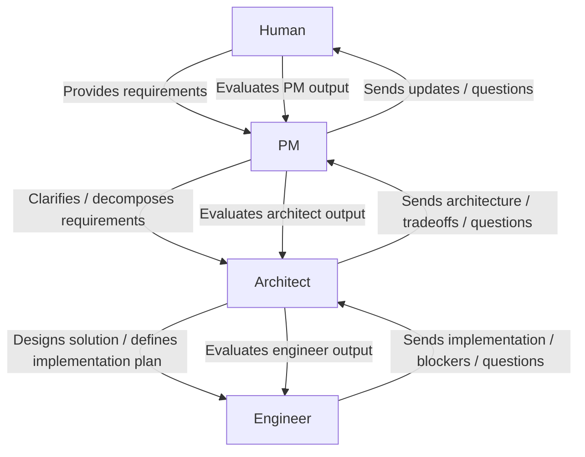

# agent-pipeline

A file-based multi-agent framework for software projects. A PM, architect, and engineer agent coordinate through markdown files to plan, spec,
implement, and review work one iteration at a time.

No infrastructure. No APIs. Just files.

---

## How it works


Each agent reads its inbox, acts, and writes to the next agent's inbox.
You only get involved when an iteration is complete or a blocker needs
a product decision. Every step produces a file you can read.

---

## Setup

### 1. Use this template

Click **Use this template** on GitHub. Clone your new repo locally.

### 2. Run setup
```bash
bash setup.sh
```

You will be prompted for the absolute path to your project:
```
Enter the absolute path to your project: /Users/you/code/my-project
```
## Onboarding to an existing project

Before writing requirements, drop an onboarding file into the PM inbox:

    cp agents/schemas/onboarding.md agents/pm/inbox/YYYY-MM-DD_HH-MM_onboarding.md
    # fill it out

Run each agent once with: Check your inbox and proceed.
No code will be written. Agents orient themselves before any work starts.

---

## Starting a project

### 1. Write your requirements
```bash
cp agents/schemas/requirements.md agents/human/outbox/$(date +%Y-%m-%d)_001_requirements.md
# fill it out
cp agents/human/outbox/*requirements* agents/pm/inbox/
```

### 2. Run each agent in turn

Use each agent's `role.md` as the system prompt. User message:
```
Check your inbox and proceed.
```

Agents: `pm` → `architect` → `engineer` → `architect` → `pm` → `you`

### 3. Review and iterate

The PM drops a summary into `agents/human/inbox/` when an iteration
is accepted. Fill out `agents/schemas/feedback.md` and drop it in
`agents/pm/inbox/` to begin the next iteration.

---

## Refactors and config extraction

Drop the relevant schema directly into `agents/pm/inbox/`:
```bash
cp agents/schemas/refactor.md agents/pm/inbox/YYYY-MM-DD_HH-MM_refactor.md
# fill it out
```

---

## File naming
```
YYYY-MM-DD_HH-MM_[type]_[id].md
```

Timestamp prefix ensures agents process files in the correct order.

---

## Structure
```
agents/
├── human/
│   ├── inbox/        # iteration summaries arrive here
│   └── outbox/       # drop requirements and feedback here
├── pm/
│   ├── role.md
│   ├── inbox/
│   └── logs/
├── architect/
│   ├── role.md
│   ├── inbox/
│   └── logs/
├── engineer/
│   ├── role.md
│   ├── inbox/
│   └── logs/
└── schemas/          # message format templates
```

Inboxes and logs are gitignored — never committed.

---

## Schemas

| File | Written by | Purpose |
|---|---|---|
| `human-brief.md` | you | New project, feature, refactor, config, onboarding |
| `human-feedback.md` | you | Iteration feedback and bug reports |
| `iteration-plan.md` | pm | Plan sent to architect |
| `spec.md` | architect | Spec sent to engineer |
| `clarification.md` | engineer / architect | Blocking questions |
| `completion.md` | engineer | Work completed report |
| `rejection.md` | architect | Re-implement instructions |
| `arch-review.md` | architect | Accepted, forwarded to PM |
| `pm-review.md` | pm | Accepted, forwarded to you |
| `log.md` | all agents | Run log format |
| `project-state.md` | pm | Rolling project state |